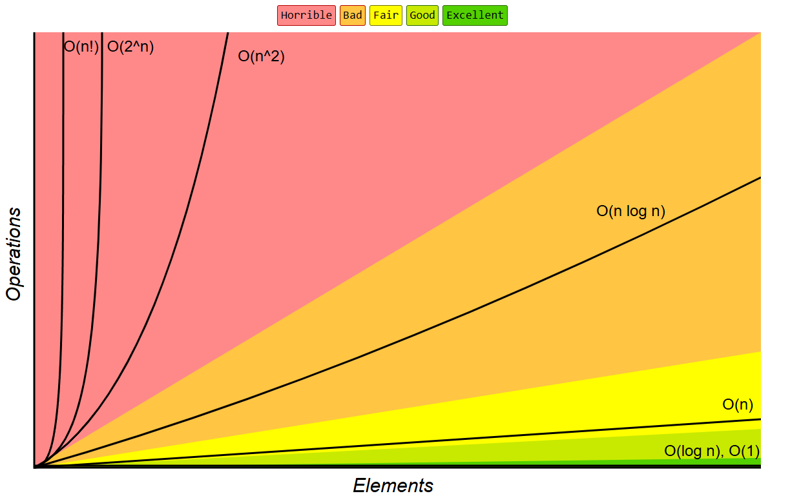

# 👀 Analysis

This is where we analyse the Big-O claim, measured results (time/space) and the inputs that hurt and helped the data structures.

# Big-O

Biney trees usually would have `Big-O (log n)` complexity, but that is only for the balanced or self-balancing trees like the Red-Black tree or the balanced BST. An unbalanced BST could lower the performance to `Big-O (n)` complexity. Log of n is better at performing using way less resources, searching for values within it. 

## Complexity Analysis
"Searching: For searching element 1, we have to traverse elements (in order 5, 4, 1) = 3 = log2n. Therefore, searching in the AVL tree has worst-case complexity of O(log2n).
Insertion: For inserting element 12, it must be inserted as the right child of 9. Therefore, we need to traverse elements (in order 5, 7, 9) to insert 12, which has the worst-case complexity of O(log2n).
Deletion: For deletion of element 9, we have to traverse the elements to find 9 (in order 5, 7, 9). Therefore, deletion in a binary tree has worst-case complexity of O(log2n)." - GeeksForGeeks,https://www.geeksforgeeks.org/dsa/complexity-different-operations-binary-tree-binary-search-tree-avl-tree/

img link - https://www.w3schools.com/dsa/dsa_data_binarysearchtrees.php
