# Binary Tree-In depth
## What is it?
Binary Search Tree, BST in short, is such a binary tree where every node has a unique key, every Node to the left, is smaller and every Node to the right is larger.

This set-up makes it very effective for quick search, addition and deletion of items.

It's effectiveness depends heavily on the order of insertion and the structure/balance of it.

## What is it made of 
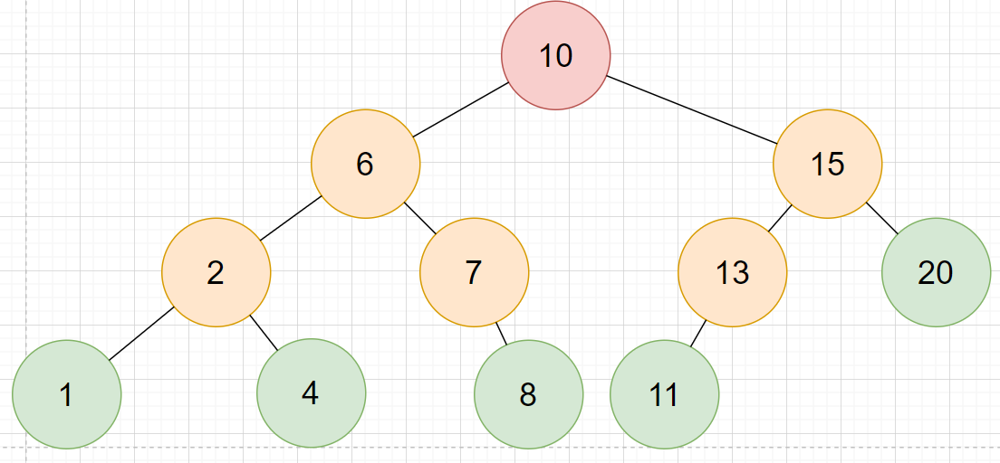

### ROOT Node 🔴
The main Node which is in the middle

### Parent Nodes 🔴🟠
All of the Nodes that have other Nodes under them

### Children Nodes 🟠🟢
Every Node apart from the ROOT Node are children Nodes of another Node. They are always to the left or right of the Parent Node depending on if they are smaller or larger.

### Leaf Nodes 🟢
Leaf Nodes are the opposite of Parent Nodes, they are the very bottom of each Sub-tree and have no Node under them.

### Sub-trees
The whole BST is split into two Sub-trees on every step and every Sub-tree is its own always halfed BST. The values from a Sub-tree to the left can never be larger then the values of a Sub-tree to the right and also the other way around.
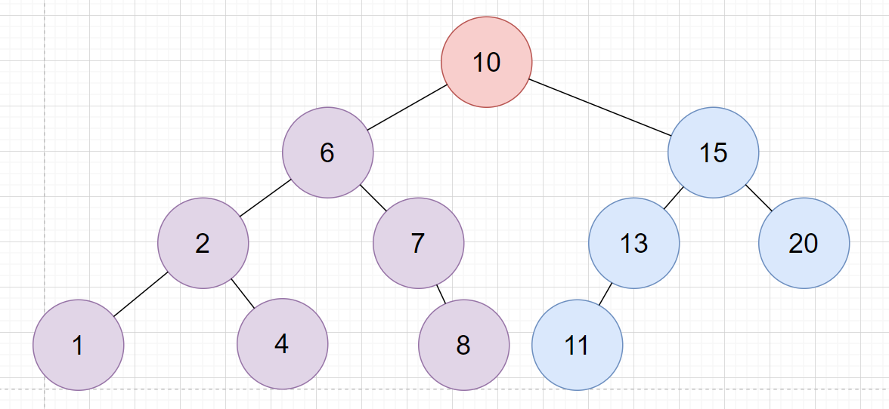
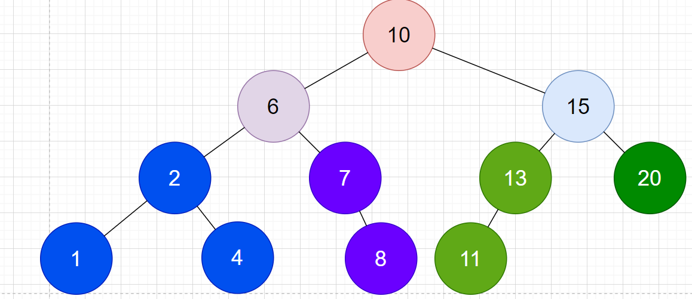

### Depth
Depth or level is how many steps you have to take from the ROOT Node to get there.

🔴ROOT Node is always 0

🟠It's children are 1

🟡Their children are 2

🟢3

Etc.
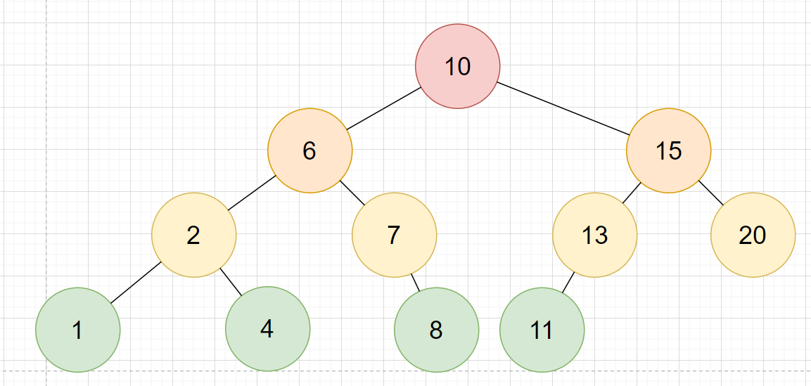
## Binary tree examples
### Invalid

#### There can't be duplicate
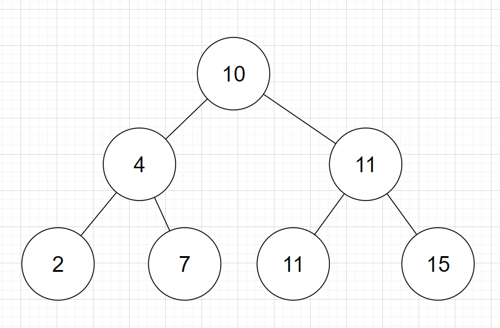

#### They have to follow the correct order
Smaller numbers on the left, bigger numbers on the right
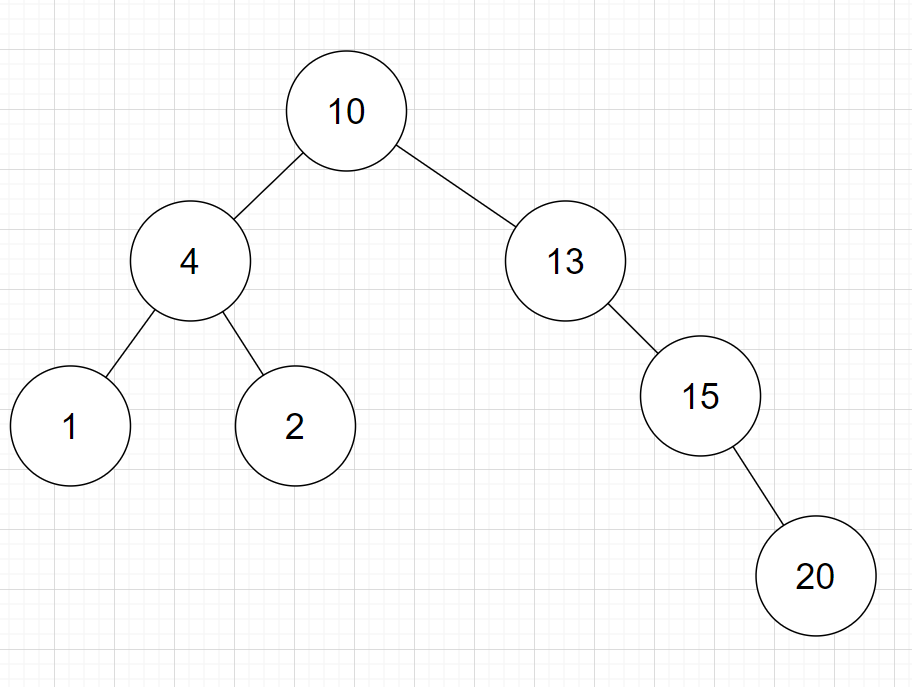

#### Boundary error
Children of Left Nodes cannot be larger then their Parents
Children of Right Nodes cannot be smaller then their Parents
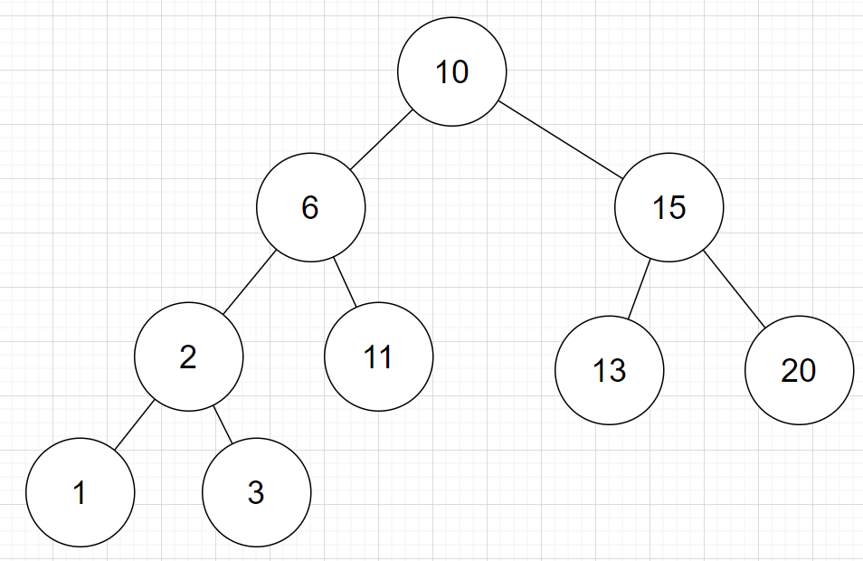

### Valid
They follow all of the above principles

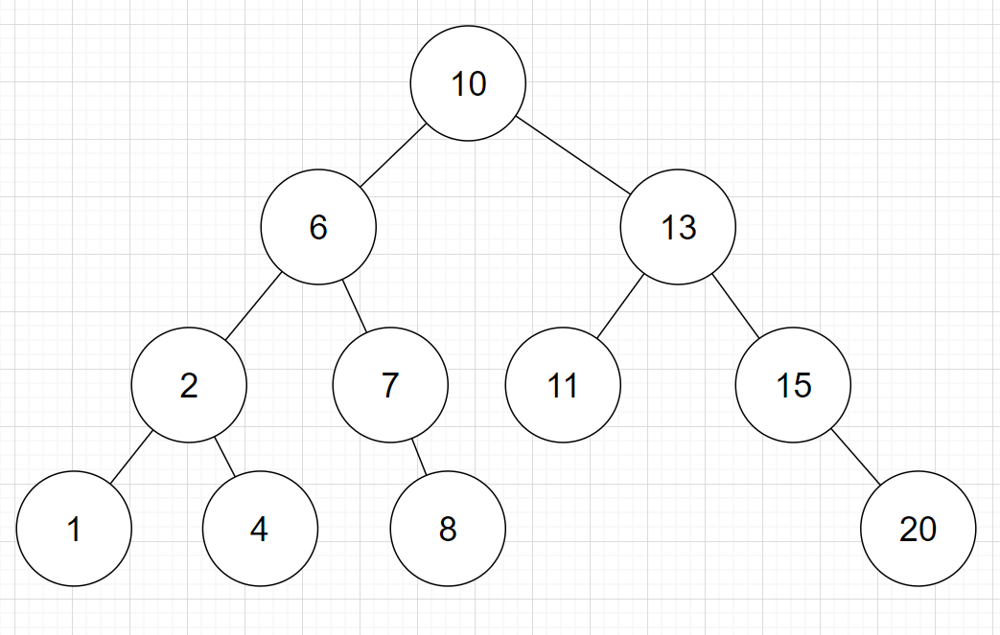
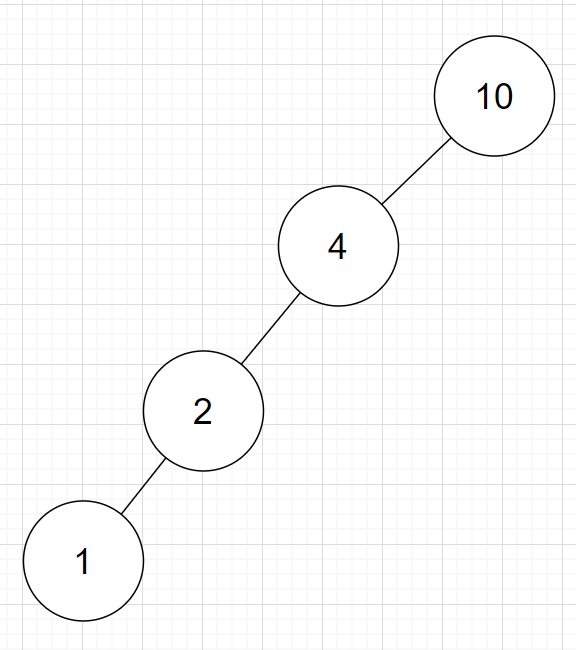
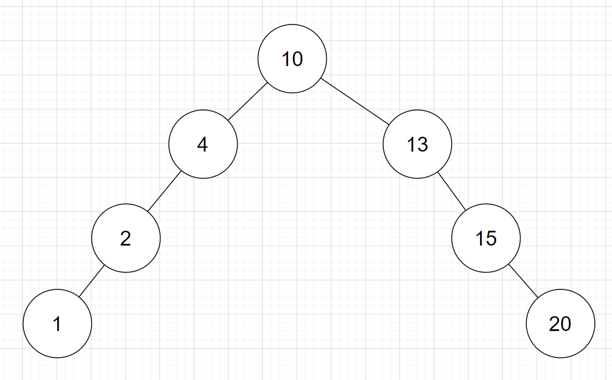

## Step by step of Creating a balanced tree
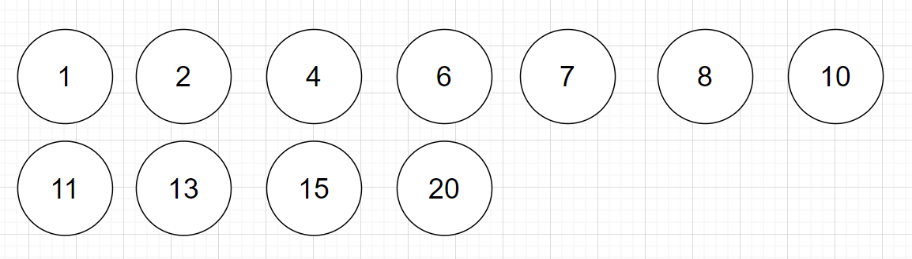
### 1)Find root node
It is the closest number to the (lowest+highest)/2

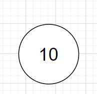

### 2)Find Children
You look to the left for the closest number to the (lowest+root)/2

Then you look to the right for the closest number to the (root+highest)/2
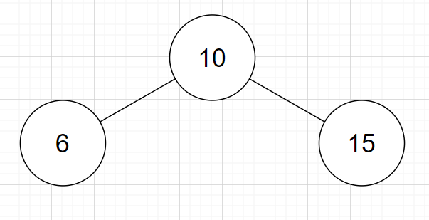

### 3)Find Children of Children
Do the same step as before, look left, look right but do it for each child Node
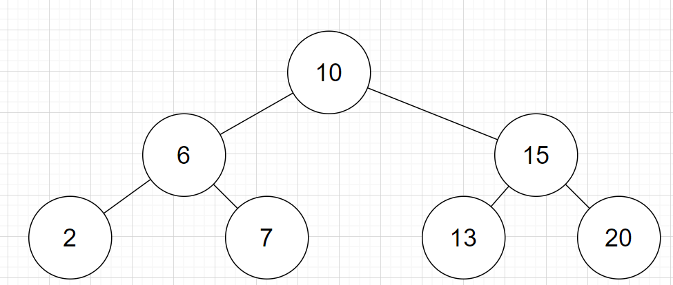

### 4)Etc. until the end
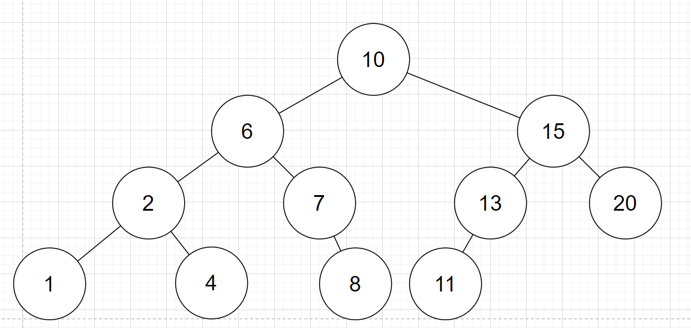

## Functions
### Search
You start at the ROOT Node and compare if the Value is >, < or ==.

Depending on the result you either go left and repeat, right and repeat or end the search.
### Add
You do the Search until you reach a Leaf and then Add either to the Left or Right of it depending on if it is < or >.
### Delete
Delete is the hardest and more varied.

First you Search for the Node:

If it is a Leaf node you safely delete.

If it is a Parent Node with only 1 child you link the Child to the Parent of the Node you are deleting and delete the Node.

If it is a Parent Node with more children you find the next Node closest to it in value by going to one of it's Sub-trees and going back in the direction of the Node you are deleting and taking the Node you find there as the replacement.
